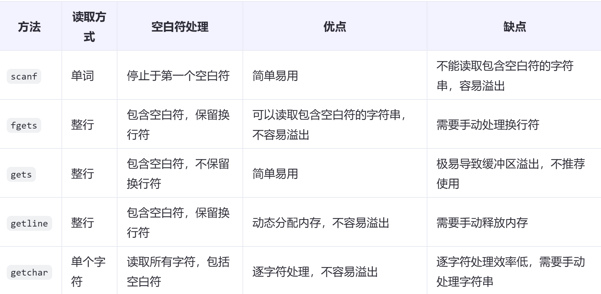

# 常见库函数及其使用方法

## <string.h>

### memset(void *s, int c, size_t n)

内存填充函数，将指针s指向的地址开始的前n个字节填充为c。主要用于初始化内存区域。

```c
#include <stdio.h>
#include <string.h>
int main() {
    char str[10];
    memset(str, '\0', sizeof(str));
    // 输出字符数组的内容，由于全部初始化为'\0'，所以不会输出任何可见字符
    printf("%s", str);
    return 0;
}
```

### strncmp(const char *s1, const char *s2, size_t n)

用于比较两个字符串的前n个字符，如果相等则返回0，否则返回第一个不相等的字符的ASCII值差。
下面进行简单的功能模拟：
```c
int my_strncmp(const char *s1, const char *s2, size_t n) {
    size_t i;
    for (i = 0; i < n; i++) {
        if (s1[i]!= s2[i]) {
            return (s1[i] - s2[i]);
        }
        if (s1[i] == '\0') {
            return 0;
        }
    }
    return 0;
}
```
## <stdlib.h>

1. **函数返回值类型和强制转换的原因**
   - 在`bsearch`函数的定义中，它的返回值类型是`void *`。这是因为`bsearch`函数被设计成可以用于查找各种类型的数组，而`void *`是一种通用的指针类型，可以指向任何数据类型。
   - 当你在使用`bsearch`函数时，你需要将返回的`void *`指针转换为你实际期望的数据类型的指针。例如，在`int *result = (int *)bsearch(&key, arr, n, sizeof(int), compare);`中，因为`bsearch`返回的是`void *`，而我们知道这个数组是`int`类型的数组，我们期望返回的指针指向`int`类型的数据，所以需要进行`(int *)`这样的强制类型转换，将`void *`转换为`int *`，这样才能正确地通过`result`指针访问和使用查找到的`int`类型的元素。

2. **函数指针类型的情况与之对比**
   - 对于函数指针，如`int (*p)(int, int);`，进行类型转换的情况是不同的。这里的`p`是一个函数指针，它被定义为指向一个函数，这个函数接受两个`int`类型的参数并返回一个`int`类型的结果。
   - 函数指针的类型转换通常是在赋值函数指针变量或者作为函数参数传递函数指针时发生。例如，如果你有一个函数`int add(int a, int b)`，要将这个函数的地址赋给`p`，你可能需要进行类型匹配的操作，如`p = (int (*)(int, int))add;`（在一些严格的类型检查环境下可能需要这样的转换，不过在很多情况下，编译器可以自动进行适当的隐式转换）。这是因为函数名本身代表函数的入口地址，当把函数名赋值给函数指针时，需要确保函数指针的类型和函数的参数列表以及返回类型相匹配，所以可能需要进行类型转换来满足这种要求。

3. **总结区别**
   - 在`bsearch`的例子中，是对`bsearch`返回的`void *`通用指针进行转换，使其符合我们期望的具体数据类型（`int *`），以便正确地访问数据。而在函数指针的情况中，是为了使函数指针变量的类型与函数的参数和返回类型正确匹配，以便能够正确地指向和调用相应的函数。
  
1. **`strstr`函数的定义和功能**
   - `strstr`函数是C语言标准库中的一个字符串处理函数，用于在一个字符串（称为主字符串）中查找另一个字符串（称为子字符串）首次出现的位置。
   - 它的函数原型为`char *strstr(const char *haystack, const char *needle);`。其中`haystack`是主字符串，`needle`是要查找的子字符串。
   - 函数返回一个指向`haystack`中第一次出现`needle`的位置的指针。如果`needle`是一个空字符串，则返回`haystack`本身(这里指的是数组首地址，不是打印字符串)；如果在`haystack`中没有找到`needle`，则返回`NULL`。

2. **`strstr`函数的用法示例**
   - **简单查找示例**
     - 下面是一个简单的C语言示例，用于在一个字符串中查找另一个字符串：
```c
#include <stdio.h>
#include <string.h>

int main() {
    char haystack[] = "This is a sample string";
    char needle[] = "sample";
    char *result = strstr(haystack, needle);
    if (result!= NULL) {
        printf("找到了子字符串，位置在: %ld\n", result - haystack);
    } else {
        printf("未找到子字符串\n");
    }
    return 0;
}
```
     - 在这个示例中，`haystack`是主字符串，`needle`是要查找的子字符串。通过`strstr`函数进行查找，得到的结果存储在`result`指针中。如果`result`不为`NULL`，则表示找到了子字符串，并且通过`result - haystack`可以计算出子字符串在主字符串中的位置（偏移量）。这里的位置计算是基于字符数组的索引，从0开始计数。
   - **处理空字符串情况**
     - 当`needle`为空字符串时，`strstr`函数会返回`haystack`本身。示例如下：
```c
#include <stdio.h>
#include <string.h>

int main() {
    char haystack[] = "Hello World";
    char needle[] = "";
    char *result = strstr(haystack, needle);
    if (result!= NULL) {
        printf("返回的结果是: %s\n", result);
    } else {
        printf("未找到子字符串\n");
    }
    return 0;
}
```
     - 在这个例子中，因为`needle`是空字符串，所以`strstr`函数返回`haystack`，程序会打印出`haystack`的内容。
   - **在循环中使用`strstr`函数进行多次查找**
     - 有时候需要在一个字符串中多次查找子字符串，可能每次找到后还需要对主字符串进行修改。例如，在一个文本处理程序中，要删除所有出现的某个单词。
```c
#include <stdio.h>
#include <string.h>

int main() {
    char text[] = "apple banana apple cherry";
    char word[] = "apple";
    char *position = strstr(text, word);
    while (position!= NULL) {
        // 计算要删除的单词的长度
        int len = strlen(word);
        // 将后面的字符向前移动，覆盖找到的单词
        for (int i = 0; i <= strlen(position + len); i++) {
            position[i] = position[i + len];
        }
        position = strstr(text, word);
    }
    printf("处理后的字符串: %s\n", text);
    return 0;
}
```
     - 在这个示例中，通过一个循环不断地使用`strstr`函数查找子字符串`word`。每次找到后，计算子字符串的长度，然后将后面的字符向前移动来覆盖找到的子字符串，从而实现删除所有出现的`word`的效果。最后打印出处理后的字符串。

3. **`strstr`函数的注意事项**
   - **字符串的可修改性**
     - 要注意`strstr`函数的参数`haystack`和`needle`通常是`const char *`类型，这意味着函数本身不会修改这两个字符串。但是如果要对找到后的字符串进行修改，比如上面删除单词的示例，就需要确保主字符串是可修改的（例如，不是指向常量字符串的指针）。
   - **字符编码和大小写敏感性**
     - `strstr`函数在比较字符串时是基于字符编码进行逐字符比较的。在默认情况下，它是区分大小写的。如果要进行不区分大小写的查找，可以先将主字符串和子字符串都转换为相同的大小写形式（例如全部转换为大写或小写），然后再使用`strstr`函数。

# 字符串读入方式总结

基本都在C语言标准函数库里面。

### scanf("%s", str)

遇到空白符停止读取，并将读入的字符串存储在首地址str后连续的内存
中（容易导致缓存区溢出）

scanf函数返回成功读取的数据项数。
`int result = scanf("%s", str);`
当scanf在读取过程中遇到文件结束（在控制台输入中，通常是在 Unix/Linux 系统下按Ctrl + D，在 Windows 系统下按Ctrl + Z后再按回车键），它会返回EOF（在<stdio.h>头文件中定义为-1）。
`while ((ret = scanf("%d", &dictionary[++len])) != EOF);`

### fgets(str, sizeof(str), stdin)

读取整行输入，包括空白符，直到达到指定的最大长度（或者换行符）

实现方式：
```c
#include <stdio.h>

int main() {
    char str[100];

    printf("Enter a string: ");
    if (fgets(str, sizeof(str), stdin) != NULL) {
        // 移除可能存在的换行符
        str[strcspn(str, "\n")] = '\0';
        printf("You entered: %s\n", str);
    } else {
        printf("Failed to read input.\n");
    }

    return 0;
}
```

注意其中的strcspn函数原型`size_t strcspn(const char *s1, const char *s2)`;
简单来说，它返回s1中从开头开始连续不包含s2中任何字符的字符数。

### getchar(void)

注意，函数定义是括号内需要写`void`表明其不需要任何输入，但在实际使用过程中空着就行（定义中会表示不确定输入数据类型）
和没有返回值的情况是不同的。

- 返回值：成功时返回读取的字符（作为 int 类型），如果到达文件结束符（EOF）或发生错误，则返回 EOF。
- 特点：每次调用 getchar 只读取一个字符，包括空白符（如空格、制表符、换行符等）。
- 应用示例：
  
```c
#include <stdio.h>

int main() {
    int ch;

    printf("Enter some text (type 'q' to quit):\n");
    while ((ch = getchar()) != EOF) {
        if (ch == 'q') {
            break;
        }
        putchar(ch);  // 打印读取的字符
    }

    return 0;
}
``` 

