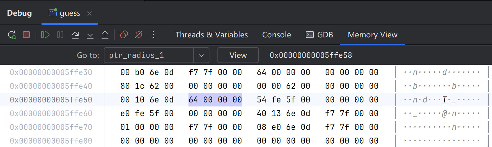
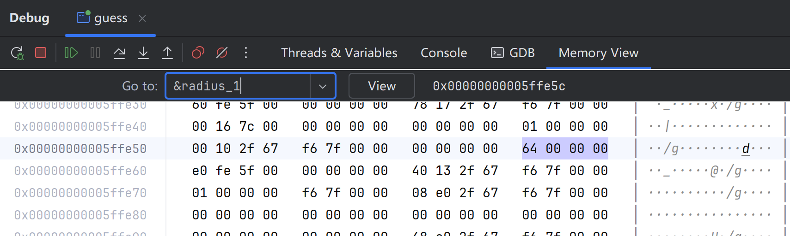
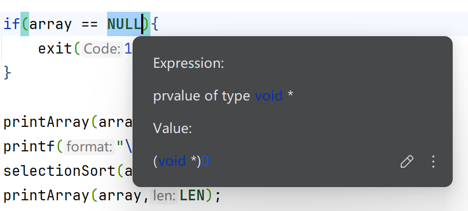

# 指针

## 定义界定

### pointer —— （typed）addresss

- 指针是一种变量，存储的是另一个变量的地址
- Manipulate variables through pointers indirectly 可以通过指针**间接**操作该变量——提供了一种间接操作变量的方式
  
```c
//int *是变量ptr_radius_1的类型：指向一个整型变量的指针变量
int *ptr_radius_1 = &radius_1;
```

```c
//ptr_radius_2对应的内存空间存储的值放到ptr_radius_1所在的内存空间中，导致两个指针变量同时指向一个变量
    ptr_radius_1 = ptr_radius_2;
```



ptr_radius_1作为一个变量也有自己的地址（5ffe8），巧合与radius_1的支持相差了4个字节

### pointer is variable

- A variable has its type,value and address.

- 示例
  
```c
#include <stdio.h>
int main(void){
    int radius_1 = 100;
    // scanf("%d",&radius_1);

    printf("radius_1 = %d\n", radius_1);
    printf("%p\n", &radius_1);
}
```

具体调试方法：在printf出设置断点，进行debug，打开`thread & variables`界面，点击watch面板上的变量名右击`show in memory view`，即可见。



分别可见内存上存储信息的地址，int长度是4个字节，在图上即显示为4个字符块。
图上数值是从右到左，从高位到低位进行读取的——往右、往下是高位。
内存是按字节进行分配的：“6”“4”共用一块存储空间，存储地址相同。

- A variablw can be used as a *lvalue* or a *rvalue*.

1. 左值：变量可以在赋值操作符的左边，代表这个变量所在的一块存储空间。`int radius_1 = 100;`
2. 右值：变量可以在赋值操作符的右边，代表这个变量的值(这个变量的存储空间内存储的数值)。
`int radius_2 = 2 * pi * radius_1;`
从上到下，发生了左值到右值的转换。

### *ptr can occur in any context where a variable can occur.

*这里的`*`是一个运算符，indirection operator，* **间接访问运算符**，也叫**解引用运算符**。

`*ptr_radius_1 = 1000`等效于 `radius_1 = 1000`，只是前者是间接操作这个变量，后者是直接操作这个变量。

### ***我们关心的是指针的类型，而非指针存储的变量地址***

```c
int i = -1;
    int *ptr_1_int = &i;
    unsigned int *ptr_1_uint = &i;
    
    printf("%d\n%d\n", *ptr_1_int, *ptr_1_uint);
    return 0;
```

此处的uint会出现错误，变为4294967295（2的32次方-1），导致进行取模运算，数值回绕。

```c
#include <stdio.h>

int main(void){
    int hex = 0x61626364;
    //char *指向一个字节大小，这里指的就是‘64’这个字节的地址
    char *ptr_hex = &hex;
    printf("%d\n", *(ptr_hex + 1));
}
```

这里结果会输出99(0x63).

## Pointers and Arrays

### In expressions,the name of an array is a synonym for the address of its first element.

*数组名就是数组的首地址*

`selectionSort(array,LEN);`等效于`selectionSort(&array[0],LEN);`

`int array[]` 就是 `int *array`的一种语法行，两者是等效的。

### arr[i] is an lvalue.

**arr[i]: `*(arr + i)`**
这就是编译器读到的内容
little trick :*`arr[i]` = `*(arr + i)` <=> `*(i + arr)` <=> `i[arr]` 
注意，这种写法是正确的*

### 指针的运算

*一般就分为三种情形(注意是根据内存条上顺序所决定的)*

p + 3 : 往前跳三个字节

- 在指向整数的前提下：3*4位，原地址0x100,新地址0x10C

p - 3 : 往后跳三个字节

- 在指向整数的前提下：3*4位，原地址0x100,新地址0xF8

p - q:两个指针指向的数组中的元素**下标**之差。

### But an array name is not an variable.(unmodified lvalue)

一个数组名只能指向一个数组的首地址，不是指针变量，可以理解为不可修改的左值。

## Dynamic Memory Management

```c
#include <stdio.h>
#include <stdlib.h>

int main(void){
    int len = 0;
    scanf("%d", &len);
    
    // int array[LEN] = {5, 2, 8, 1, 9};
    //输入需要的内存空间大小，malloc函数让操作系统给你分配一块，并返回这块内存空间的首地址
    //malloc函数返回的类型是void *,在C语言中不需要做强制类型转换（int *）
    int *array = malloc(len * sizeof(int));

    printArray(array,LEN);
    printf("\n");
    selectionSort(array,LEN);
    printArray(array,LEN);

    return 0;
}
```

声明并赋值变量，变量名前的类型确定了这一块内存空间存储的数据类型；malloc函数只是给批了你输入大小的一块空间，没有规定类型。

同时，我们为了方便修改该内存空间存储的数据类型，可以对该声明语句做以下修改

```c
#include <stdio.h>
#include <stdlib.h>

int main(void){
    int len = 0;
    scanf("%d", &len);
    

    int *array = malloc(len * sizeof(*numbers));

    printArray(array,LEN);
    printf("\n");
    selectionSort(array,LEN);
    printArray(array,LEN);

    return 0;
}
```

同时，malloc函数不一定会成功（内存空间大小不足等问题），所以需要判断是否申请成功（值是否为NULL）。

```c
if(array == NULL){
    exit(1);
}
```



地址为0的内存空间是受操作系统保护的，不允许任何人使用，相当于空指针。

**不要忘记最后`free(array);`（不用说明数组长度，操作系统已经由malloc函数得知了）**

 free的原因：

- 栈stack——函数运行时函数中内容的存放区
- 堆heap——
  
malloc函数分配出来的空间是在堆上的，不在栈中；
栈中main，swap，f函数层次嵌套，从作为链条底层的f开始自动释放对应内存空间，但进行到main函数结束时就会因为malloc出现问题，导致内存泄漏。
  
array作为main函数中的局部变量，main函数结束时，array也会被释放。但由aaray的地址指向的内存空间在堆上，所以不会被自动释放，而指针也消失了，会导致没有指针再指向这块内存空间，不再可用了。
  所以，需要手动释放。

同时，free后不能再调用array中的内容了；有且仅有malloc函数动态分配的内存空间可以被free也必须被free。
